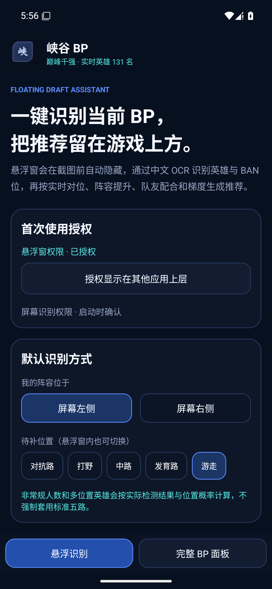

# 峡谷 BP

面向《王者荣耀》的实时选将助手。站点从天元之弈服务端抓取“巅峰千强”英雄列表、英雄梯度、克制关系与组合关系，支持：

[在线使用](https://xia-gu-bp-live.yxf3173616612.chatgpt.site/) · [下载 Android APK](https://github.com/3173616612/xia-gu-bp/releases/latest) · [Android 使用说明](android/README.md)

- 查询某位英雄克制谁、被谁克制及对应样本量；
- 录入敌我双方五路阵容；
- 维护 BAN 位，并从推荐卡直接把候选标记为已 Ban；
- 按待补位置推荐英雄；
- 综合阵容提升、对敌净分、队友配合与压缩梯度生成可解释推荐分；输入不完整时自动适配可用证据。
- 阵容提升分只在对敌净分超过中性线时，衡量其相对自身常规梯度的增幅；中性或劣势不会因梯度低而获利，避免 T0 强度在梯度与关系数据中被重复奖励。
- 对敌劣势与队友冲突会作为独立负向证据扣分，所有关系分均来自巅峰千强实时样本。

## 本地运行

```bash
npm install
npm run dev
```

生产构建：

```bash
npm run build
```

上游数据仅供个人学习和 BP 参考；本项目与腾讯游戏、天美工作室无关联。

## Android 悬浮助手

原生 APK 同时支持手动自选阵容与悬浮识别：可录入敌我英雄、BAN 位和待补分路，也可用本地英雄头像匹配识别两侧已选阵容与顶部 BAN 位。推荐算法内置，英雄、梯度和四类关系直接读取天元之弈国内接口，不依赖公开站点；头像库随原始接口的 `avatarUrl` 指纹增量更新。构建、隐私和非标准阵容说明见 [`android/README.md`](android/README.md)。



最新版为 **v1.7.0**，支持 Android 8.0 及以上。APK 在 Release 页面提供，SHA-256 同时写入发布说明。

## 数据来源与声明

- 数据来源：[天元之弈](https://tianyuanzhiyi.com/)，使用其公开返回的英雄、巅峰千强梯度与英雄关系数据。
- 创意及作者：3173616612@qq.com。
- 本项目是个人学习与选将参考工具，不是腾讯游戏或天美工作室官方产品，也不会代替玩家进行游戏操作。
